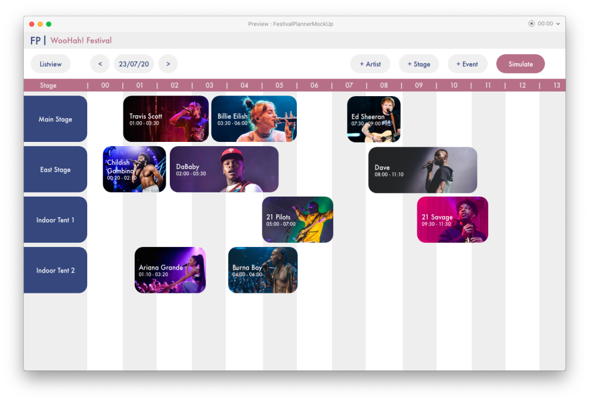

# IndividueelP3B1

## Inhoudsopgave

1. [Week 2](#week2)
2. [Week 3](#week3)
3. [Week 4](#week4)
4. [Week 5](#week5)

---

## Week 2 <a name="week2"></a>

We hebben deze week het klassediagram gemaakt voor de festivalPlanner agenda :


We hebben er voor gekozen om Custom buttons (fp_modules map) te gebruiken. Zodat we redelijk makkelijk een mooi thema kunnen aanhouden zonder elke keer de layout van elk textfield en button aan te passen.

---

Ook hebben we ervoor gekozen om een inlog pagina te maken waarbij de inloggegevens in een database zitten.

Als laatste hebben we een mooi design gemaakt voor de agenda :



We hebben er voor gekozen om een verschuivende agenda te maken d.m.v. 2DGraphics. Dit maakt alles erg gebruiksvriendelijk.

Voor de rest ging het deze week erg goed en hebben we op de projectdag de github volledig goed opgezet, de opzet van de klassen

---

Zelf heb ik samen met de rest het klassediagram gemaakt, ook heb ik de opzet van de code gemaakt (alle klassen aanmaken, met attributen en goede verbindingen met andere klassen). Daarnaast heb ik vandaag ook de github goed opgezet met branches en alles.

**Wat is de situatie?**

We wisten niet hoe we al het werk over iedereen moesten verdelen qua code schrijven.

**Welke keuzemogelijkheden heb je?**

- We kunnen het werk onder koppels verdelen
- We kunnen met ze allen samen de GUI gaan maken

**Welke keuze heb je gemaakt?**

We hebben ervoor gekozen om Extreme Programming toe te passen bij ons project, en veel werk te verdelen in koppels. Hierdoor zijn dus 2 mensen aan de slag gegaan met de opzet van het hele project (dat heb ik gedaan), 2 anderen aan het skelet voor de GUI en de laatste 2 hebben het begin van de 2DGraphics agenda gemaakt.

**Waarom heb je deze keuze gemaakt**

Omdat iedereen Extreme Programming in de groep fijn vond om mee te werken.


---


## Week 3 <a name="week3"></a>

Er is vandaag verder gegaan met het maken van de agendamodule. Zelf heb ik de "StageView" klasse gemaakt. Hierin kan je nieuwe stages aanmaken, bewerken, verwijderen en bekijken. Ook heb ik samen met de rest een paar branches met elkaar gemerched, en de code aangepast aan de codestyle guide


Bij het maken van de StageView klasse had ik nog wel een probleem:

**Wat is de situatie?**

Ik wist niet hoe ik stages moest bewerken.

**Welke keuzemogelijkheden heb je?**

- Je kan kijken wanneer er een event toevoegd word, of er al een event bestaat met dezelfde naam, en als dit zo is, dat hij het oude event overschrijft met het nieuwe.
- Je maakt een edit knop, en als je hier op klikt, dan kan je de stage bewerken.

**Welke keuze heb je gemaakt?**

Het overschrijven van het oude event door de nieuwe als deze dezelfde naam hebben.

**Waarom heb je deze keuze gemaakt**

Dit was een makkelijkere oplossing, want ik wist niet hoe je een geselecteerd item uit de listview moest opvragen en bewerken.


---


## Week 4 <a name="week4"></a>

Deze week is er gewerkt aan: 
- De map maken voor de simulatie module
- De methodes maken voor het inlezen van de map
- bugs fixen
- verder werken aan PVA

Zelf ben ik verder gegaan aan het plan van aanpak, en de bugs fixen. Bij het plan van aanpak heb ik de koppen "Kosten en batem", "Projectorganisatie", "Tussenresultaten" & "Projectresultaat" gemaakt. Dit verliep goed.


Bij het bugs fixen heb ik ervoor gezorgd dat: 
- een artiest niet meerdere keren op een overlappend tijdstip kan worden ingepland.
- als een podium word verwijderd worden alle event hierbij ook verwijderd.
- en als een artiest word verwijderd worden alle events die bij deze artiest horen ook verwijderd.

Bij het bug fixen ben ik tegen het volgende probleem aangekomen:

**Wat is de situatie?**

Ik kreeg de hele tijd een current modification exception tijdens het proberen op te lossen van het verwijderen van alle events die gekoppeld zijn aan een artiest die verwijderd is. Het probleem was alleen dat ik en niemand in de projectgroep geen idee had wat deze exceptie inhield.

**Welke keuzemogelijkheden heb je?**

Opzoeken op internet wat de exceptie inhoud en hier de code op aanpassen.

**Welke keuze heb je gemaakt?**

Optie 1: Ik heb op internet opgezocht wat deze fout inhield. De fout werd in de code veroorzaakt omdat er in de for-each objecten werden verwijderd uit de array. Dus hebben we het opgelost op de volgende manier.

```
public void removeArtist(Artist artist){

        ArrayList<Event> tempEvents = new ArrayList<>();

        for ( Event event : this.events ){
            if ( event.getHeadArtist().getName().equals(artist.getName()) || event.getCoArtist().getName().equals(artist.getName()) ){
                tempEvents.add(event);
            }
        }

        for (Event event : tempEvents) {
            if (this.events.contains(event)){
                removeEvent(event);
            }
        }
        this.artists.remove(artist);

        IO.writeArrayListArtist(this.artists, "resources/SavedFiles/SavedArtists.txt");

        this.artists.removeAll();
        this.artists = IO.readArtistFile("resources/SavedFiles/SavedArtists.txt");
    }
```

**Waarom heb je deze keuze gemaakt**

Deze oplossing kwam bij mij als eerst goede idee op. Daarnaast compileert de code en is de bug nu gefixt.


---


## Week 5 <a name="week5"></a>

Deze week heb ik gewerkt aan de opzet van de simulatie module, de map inladen en aan de visitors van de simulatie module. Dit ging redelijk goed totdat ik moest implementeren dat visitors van elkaar weg moeten gaan als ze tegen elkaar lopen.

**Wat is de situatie?**

Bij de simulatie module moeten hitboxen worden toegevoegd aan de visitors. Deze hitboxen moeten ervoor zorgen dat visitors niet tegen elkaar lopen. Alleen dit kreeg ik niet voor elkaar.


**Welke keuzemogelijkheden heb je?**

- Zorgen dat de visitors nooit tegen elkaar aankomen.
- Zorgen dat als visitors tegen elkaar aankomen ze gaan draaien totdat de richting waar ze naartoe kijken niemand staat.


**Welke keuze heb je gemaakt?**

Optie 2. Een visitor kijkt nu bij elke iteratie of de afstand van één van de andere visitors kleiner is dan de grootte van zichzelf.

```
private boolean collision(Point2D position) {
        for (Visitor visitor : this.otherVisitors) {
            if (position.distance(visitor.getPosition()) < this.hitbox.getWidth()) {
                if (visitor != this) {
                    return true;
                }
            }
        }
        return false;
    }
```

**Waarom heb je deze keuze gemaakt**

Ik had eerst de eerste optie geprobeerd te implementeren door een lijn te trekken vanaf de visitor naar de target, en als dan de lijn overlapt met iets anders dan moet de visitor zijn pad aanpassen. Dit is alleen niet gelukt want ik had geen idee hoe ik het pad moest aanpassen. Daarna heb ik optie 2 geprobeerd en dit ging een stuk makkelijker met implementeren.
