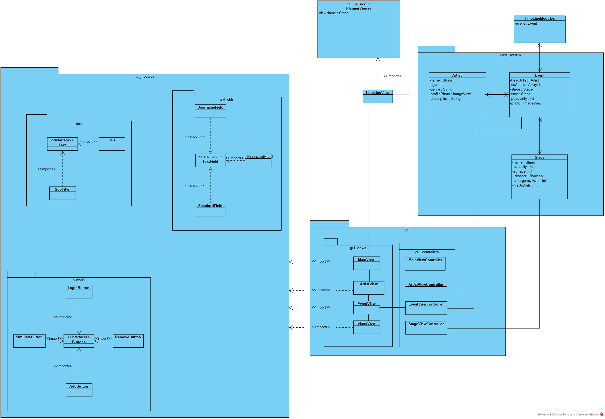

# IndividueelP3B1

### Week 2

We hebben deze week het klassediagram gemaakt voor de festivalPlanner agenda :

We hebben er voor gekozen om Custom buttons (fp_modules map) te gebruiken. Zodat we redelijk makkelijk een mooi thema kunnen aanhouden zonder elke keer de layout van elk textfield en button aan te passen.

---

Ook hebben we ervoor gekozen om een inlog pagina te maken waarbij de inloggegevens in een database zitten.

Als laatste hebben we een mooi design gemaakt voor de agenda :

We hebben er voor gekozen om een verschuivende agenda te maken d.m.v. 2DGraphics. Dit maakt alles erg gebruiksvriendelijk.

Voor de rest ging het deze week erg goed en hebben we op de projectdag de github volledig goed opgezet, de opzet van de klassen

---

Zelf heb ik samen met de rest het klassediagram gemaakt, ook heb ik de opzet van de code gemaakt (alle klassen aanmaken, met attributen en goede verbindingen met andere klassen). Daarnaast heb ik vandaag ook de github goed opgezet met branches en alles.
